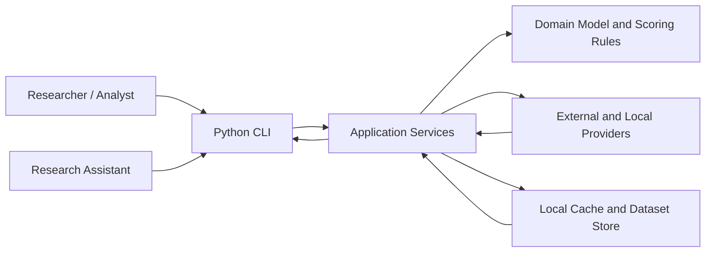
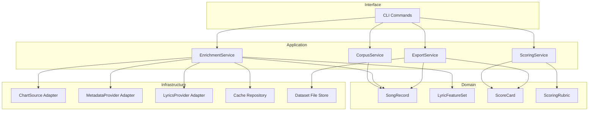
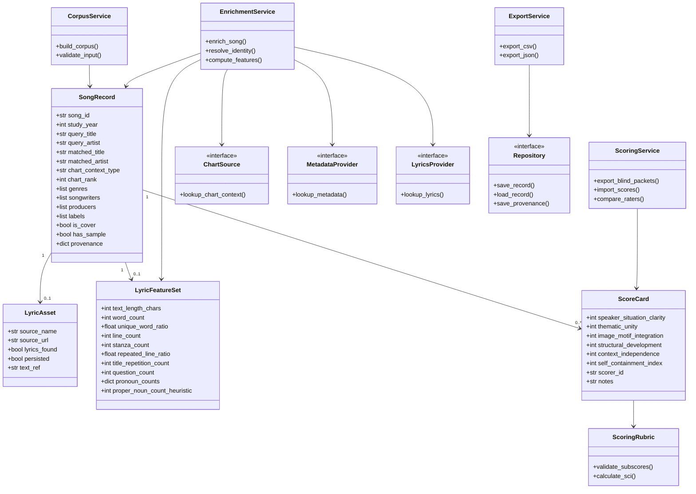
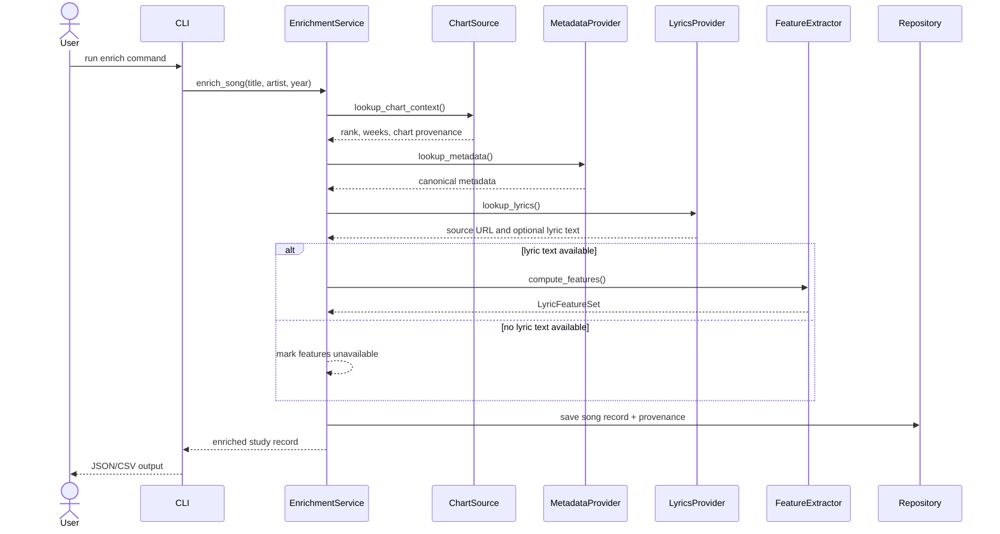
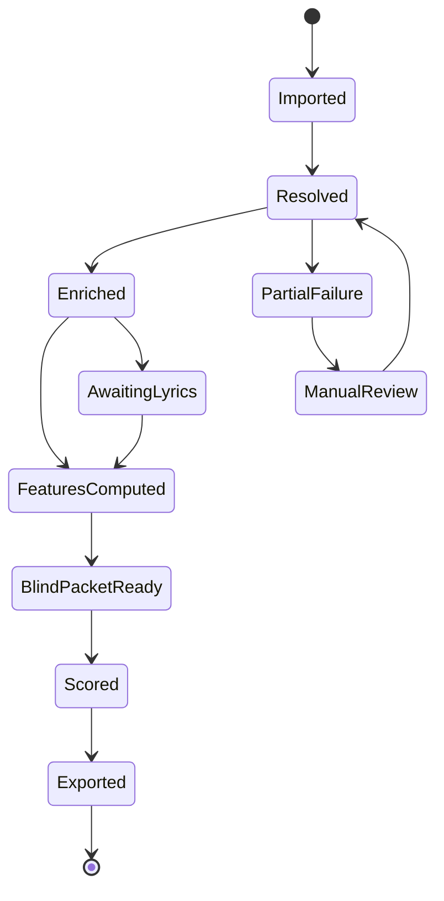
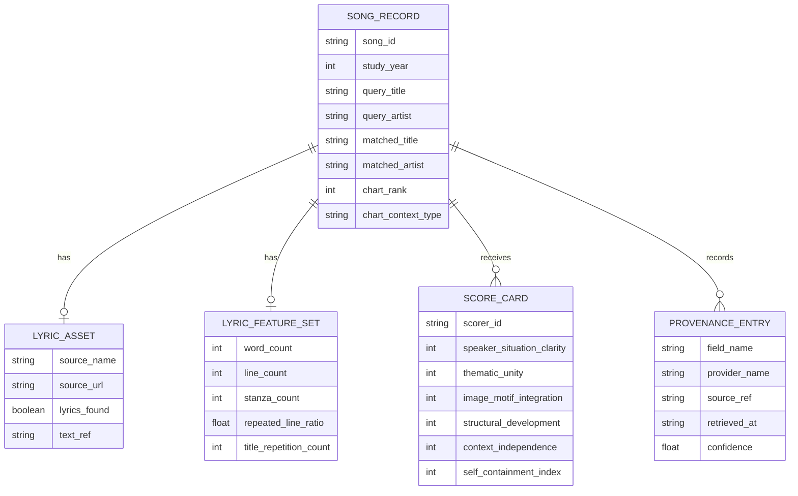

# Study Design SRS

**Document type:** Software Requirements Specification  
**Standard:** IEEE 830-style structure  
**Project:** Music Study Data Collection and Scoring System  
**Target implementation:** Python, layered architecture, full unit-test coverage  
**Status:** Draft v0.1  
**Related documents:** `design/Music-Study-Design.md`, `song_study_lookup.py`

## 1. Introduction

### 1.1 Purpose

This document specifies the software requirements for a Python system that supports the study described in [Music-Study-Design.md](./Music-Study-Design.md). The system will build a research corpus of songs, enrich each song with chart and music metadata, retrieve lawful lyric access where available, compute derived lyric features, support blind scoring for the study's Self-Containment Index, and export analysis-ready datasets.

The SRS is intended to guide implementation, testing, and later maintenance. It also serves as a bridge between the current prototype script and a production-quality research system.

### 1.2 Scope

The software system will:

- ingest a selected corpus of songs for study years such as `1965`, `1975`, `1985`, `1995`, `2005`, and `2015`
- enrich each song with metadata needed by the study, including chart context, writers, producers, label, genre, release timing, and cover/sample indicators when available
- retrieve lyrics or lyric source references from approved sources
- compute derived lyric features without requiring publication of copyrighted lyrics
- support blind human or LLM-assisted scoring against the study rubric
- export datasets suitable for statistical analysis and audit
- provide unit-testable services and a layered Python architecture

The software will not:

- publish copyrighted lyrics by default
- claim that open-source providers offer perfect coverage for all metadata fields
- replace human interpretive judgment for the five study subscores

### 1.3 Intended Audience

This SRS is for:

- the principal researcher defining the study protocol
- developers implementing the Python system
- research assistants collecting, auditing, or scoring songs
- reviewers evaluating validity, reproducibility, and legal compliance

### 1.4 Definitions, Acronyms, and Abbreviations

| Term | Meaning |
|---|---|
| **SCI** | Self-Containment Index, the study's 0-10 aggregate score |
| **Subscore** | One of the five 0-2 scoring dimensions in the study rubric |
| **Corpus** | The set of songs selected for a study phase |
| **Provider** | An external or local source of data, such as Billboard archive, MusicBrainz, or a lyrics provider |
| **Enrichment** | The process of adding metadata or computed features to a song record |
| **Blind scoring packet** | A scoring record that hides fields such as year and artist to reduce bias |
| **Provenance** | The origin, method, and timestamp of collected data |
| **SUT** | System Under Test |

### 1.5 References

- `design/Music-Study-Design.md`
- `song_study_lookup.py`
- IEEE 830, *Recommended Practice for Software Requirements Specifications*

### 1.6 Overview

Section 2 describes the product as a whole, including users, environment, and constraints.  
Section 3 defines functional and non-functional requirements.  
Section 4 describes the architecture, layered design, and UML model.  
Section 5 defines testing and verification requirements.  
Appendix A reviews the current prototype and traces it to the target system.

## 2. Overall Description

### 2.1 Product Perspective

The current `song_study_lookup.py` script is a working prototype, not a full system. It already demonstrates several good design instincts:

- it favors metadata plus derived lyric features over lyric redistribution
- it treats chart history, music metadata, and lyrics as separate sources
- it provides study-oriented output fields instead of raw scraping only
- it already exposes key computed features such as `line_count`, `stanza_count`, `repeated_line_ratio`, `pronoun_counts`, and `title_repetition_count`

The current prototype also has important gaps:

- it is implemented as a single file rather than a layered package
- it has no batch ingestion pipeline for year-based study corpora
- it has no persistent cache, provenance store, or audit log
- it has no blind scoring workflow
- it has no formal unit tests or integration tests
- it conflates a prototype lookup interface with a long-term research pipeline
- it returns best weekly chart rank from the local archive, not a year-end Top 100 ranking

The target system shall therefore evolve from a script into a modular Python application.

### 2.2 Product Functions

At a high level, the system shall provide these functions:

- corpus definition and import
- song identity resolution and normalization
- chart context lookup
- provider-based metadata enrichment
- lawful lyric access and source tracking
- derived lyric feature extraction
- blind scoring packet generation
- scoring result ingestion and SCI calculation
- export of analysis-ready datasets
- caching, logging, provenance, and testability

### 2.3 User Classes and Characteristics

| User class | Description | Needs |
|---|---|---|
| **Research lead** | Defines study scope and scoring rubric | Repeatable datasets, auditability, export quality |
| **Research assistant** | Reviews songs, audits matches, scores lyrics | Clear scoring packets, low-friction tools |
| **Developer** | Implements and maintains system | Clean architecture, stable interfaces, tests |
| **Analyst** | Runs statistical analysis on exported data | Tidy, validated outputs and field definitions |

### 2.4 Operating Environment

The software shall operate in:

- Python `3.12+`
- macOS, Linux, and CI-compatible shell environments
- local filesystem with read/write access for caches, exports, and test fixtures
- optional network access for approved providers

The software shall support:

- local CSV sources such as the Billboard archive already present in this repository
- HTTP-based providers for music metadata and lyric access
- offline reruns from cached provider responses where available

### 2.5 Design and Implementation Constraints

- The system shall be written in Python.
- The system shall use a layered architecture that separates interfaces, application orchestration, domain rules, and infrastructure providers.
- The system shall not store or export copyrighted lyrics by default.
- The system shall preserve provenance for provider-derived fields.
- The system shall tolerate incomplete, conflicting, or missing third-party metadata.
- The system shall expose configurable provider policy so that only approved lyric sources are used.
- The system shall support deterministic unit tests that do not require live network access.

### 2.6 Assumptions and Dependencies

- The study's scoring rubric in `Music-Study-Design.md` remains the authoritative interpretive framework.
- Local chart data or a separate year-end chart source will be available for the chosen study years.
- Some fields, especially producers, sample relationships, and label data, may require manual audit or licensed providers.
- Human or LLM-assisted scoring remains necessary for high-level interpretive subscores.

## 3. Specific Requirements

### 3.1 External Interface Requirements

#### 3.1.1 User Interfaces

The system shall provide:

- a CLI for corpus creation, enrichment, scoring packet export, score import, and dataset export
- machine-readable JSON outputs for single-song lookup and diagnostics
- CSV outputs for analysis-ready datasets
- Markdown or JSON scoring packets for blind review workflows

#### 3.1.2 Software Interfaces

The system shall support these interface classes:

- **ChartSource** interface for local chart archives and future year-end chart providers
- **MetadataProvider** interface for recording, writer, producer, genre, and label enrichment
- **LyricsProvider** interface for lyric access subject to provider policy
- **Repository** interface for local persistence, cache, and provenance
- **ScoringStore** interface for rubric packets and scored results

#### 3.1.3 Communications Interfaces

When network providers are enabled, the system shall use HTTP(S) with:

- provider-specific rate limiting
- request timeouts
- retry and backoff behavior for transient failures
- stable user-agent identification where required

### 3.2 System Features

#### 3.2.1 Corpus Definition and Intake

**Description:** The system shall create a study corpus for pilot, expanded, and full phases.

**Functional requirements**

- `FR-001` The system shall ingest a corpus definition file containing at minimum `year`, `title`, and `artist`.
- `FR-002` The system shall support study phases equivalent to `Top 25`, `Top 50`, and `Top 100` per selected year.
- `FR-003` The system shall preserve the source of corpus selection, including chart source name and date of import.
- `FR-004` The system shall reject malformed input rows and emit row-level validation errors.

#### 3.2.2 Song Resolution and Identity Matching

**Description:** The system shall normalize and resolve title and artist identity across providers.

**Functional requirements**

- `FR-010` The system shall normalize punctuation, accents, and common featuring-artist variations during matching.
- `FR-011` The system shall compute a confidence score for each provider match.
- `FR-012` The system shall record both query values and matched canonical values.
- `FR-013` The system shall allow manual override of incorrect matches.
- `FR-014` The system shall preserve unresolved records rather than silently dropping them.

#### 3.2.3 Chart Context

**Description:** The system shall attach chart-derived context to each song.

**Functional requirements**

- `FR-020` The system shall ingest or resolve chart rank, chart year, chart source, and chart methodology era.
- `FR-021` The system shall distinguish between `best weekly rank` and `year-end rank`.
- `FR-022` The system shall preserve first and last chart dates when weekly history is available.
- `FR-023` The system shall permit the study to select either weekly-context or year-end-context pipelines.

#### 3.2.4 Metadata Enrichment

**Description:** The system shall enrich songs with the study's contextual metadata.

**Functional requirements**

- `FR-030` The system shall attempt to retrieve release date, genre, label, songwriters, producers, and recording duration.
- `FR-031` The system shall derive `writer_count` and `producer_count`.
- `FR-032` The system shall flag `is_cover` and `has_sample` when provider evidence supports those conclusions.
- `FR-033` The system shall record field-level provenance for each enriched attribute.
- `FR-034` The system shall mark unavailable fields explicitly as `unknown` or `missing`, not as inferred facts.

#### 3.2.5 Lyrics Access and Compliance

**Description:** The system shall retrieve lyric references or lyric text only through configured providers.

**Functional requirements**

- `FR-040` The system shall record a `lyrics_source_url` when lyric access is found.
- `FR-041` The system shall omit full lyric text from default exports.
- `FR-042` The system shall permit full lyric storage only when explicitly configured and legally authorized.
- `FR-043` The system shall log provider policy status for each lyric source.
- `FR-044` The system shall support feature extraction from in-memory lyric text without requiring permanent lyric persistence.

#### 3.2.6 Derived Lyric Feature Extraction

**Description:** The system shall compute mechanical features that support the study.

**Functional requirements**

- `FR-050` The system shall compute `text_length_chars`, `word_count`, `line_count`, `stanza_count`, `unique_word_ratio`, `repeated_line_ratio`, and `question_count`.
- `FR-051` The system shall compute `title_repetition_count`.
- `FR-052` The system shall compute pronoun counts at minimum for first, second, and third person.
- `FR-053` The system shall compute a heuristic proper-noun signal and mark it as heuristic.
- `FR-054` The system shall support extension points for future features such as sentiment arc, section count, and narrative markers.

#### 3.2.7 Blind Scoring Workflow

**Description:** The system shall support human or LLM-assisted interpretive scoring without exposing study-biasing metadata by default.

**Functional requirements**

- `FR-060` The system shall export blind scoring packets that hide year, chart rank, and artist identity by default.
- `FR-061` The system shall include the five rubric dimensions in each scoring packet.
- `FR-062` The system shall support import of completed scores from human raters or LLM scoring runs.
- `FR-063` The system shall compute the SCI as the sum of the five 0-2 subscores.
- `FR-064` The system shall preserve scoring notes and rationale where provided.
- `FR-065` The system shall support inter-rater comparison outputs.

#### 3.2.8 Dataset Export

**Description:** The system shall emit outputs suitable for analysis and audit.

**Functional requirements**

- `FR-070` The system shall export an analysis-ready flat dataset in CSV format.
- `FR-071` The system shall export a richer JSON representation with provenance and provider details.
- `FR-072` The system shall export separate files for corpus definition, enriched records, scoring packets, scores, and final joined datasets.
- `FR-073` The system shall support reproducible reruns that regenerate outputs from cached inputs where possible.

#### 3.2.9 Observability and Recovery

**Description:** The system shall provide diagnosability and controlled failure handling.

**Functional requirements**

- `FR-080` The system shall log provider requests, cache hits, retry attempts, and match confidence.
- `FR-081` The system shall preserve row-level error states without aborting the full batch unless configured to do so.
- `FR-082` The system shall emit a summary report of completed, partial, and failed records.
- `FR-083` The system shall support resumable batch execution from the last successful checkpoint.

### 3.3 Non-Functional Requirements

#### 3.3.1 Performance

- `NFR-001` The system shall process a pilot corpus of 150 songs in under 30 minutes when provider rate limits and network conditions are normal.
- `NFR-002` Cached reruns of the same pilot corpus shall complete in under 5 minutes.
- `NFR-003` Single-song lookups shall return local-only chart results in under 2 seconds on a typical developer machine.

#### 3.3.2 Reliability

- `NFR-010` The system shall not lose already processed records because one provider fails on a later record.
- `NFR-011` The system shall support checkpointed batch execution.
- `NFR-012` The system shall produce deterministic outputs from deterministic cached provider responses.

#### 3.3.3 Maintainability

- `NFR-020` The system shall isolate provider-specific code from domain logic.
- `NFR-021` The system shall be structured so that a provider can be swapped without changing scoring logic.
- `NFR-022` The system shall include unit tests for all core services and adapters.
- `NFR-023` The system shall use typed Python interfaces and validated data models.

#### 3.3.4 Legal and Ethical Compliance

- `NFR-030` The system shall default to metadata-and-features exports rather than lyric redistribution.
- `NFR-031` The system shall preserve source references for all lyric-derived computations.
- `NFR-032` The system shall mark heuristic and inferred fields clearly.

#### 3.3.5 Usability

- `NFR-040` The CLI shall provide actionable validation errors and progress summaries.
- `NFR-041` The system shall generate scoring packets that a non-developer research assistant can use directly.

## 4. Architecture and UML Description

### 4.1 Layered System Design

The implementation shall use the following logical layers:

1. **Interface layer**  
   CLI commands, configuration loading, export formatting

2. **Application layer**  
   Use-case orchestration such as `build_corpus`, `enrich_song`, `generate_scoring_packets`, and `assemble_final_dataset`

3. **Domain layer**  
   Core entities, scoring rules, feature models, validation rules, and requirement-invariant logic

4. **Infrastructure layer**  
   Provider adapters, cache, repositories, filesystem persistence, and HTTP clients

5. **Test layer**  
   Unit tests, fixture-driven integration tests, contract tests for providers, and reproducibility tests

### 4.2 Proposed Python Package Structure

```text
rwd-billboard-data/
  design/
    Music-Study-Design.md
    study-design-srs.md
  study_system/
    interfaces/
      cli.py
      commands/
        lookup.py
        build_corpus.py
        enrich.py
        score.py
        export.py
    application/
      services/
        corpus_service.py
        enrichment_service.py
        scoring_service.py
        export_service.py
      dto.py
    domain/
      models.py
      scoring.py
      feature_rules.py
      provider_types.py
    infrastructure/
      providers/
        chart_source.py
        musicbrainz_provider.py
        lyrics_provider.py
      persistence/
        repositories.py
        cache_store.py
        file_store.py
      http/
        client.py
        retry.py
    config/
      settings.py
  tests/
    unit/
    integration/
    fixtures/
```

### 4.3 System Context Diagram



### 4.4 Component Diagram



### 4.5 UML Class Model



### 4.6 Sequence Diagram for Single-Song Enrichment



### 4.7 State Diagram for Record Processing



### 4.8 Logical Data Model



### 4.9 UML Narrative

The UML model above defines the system as a set of stable domain entities controlled by application services and fed by replaceable provider interfaces.

- `SongRecord` is the aggregate root for a study row.
- `LyricAsset` is intentionally separate from `LyricFeatureSet` so that lawful lyric access and feature persistence can be managed independently.
- `ScoreCard` is many-to-one with `SongRecord` because multiple raters or LLM runs may score the same lyric.
- `ScoringRubric` centralizes SCI validation so the sum and subscore bounds are not duplicated across interfaces.
- `ChartSource`, `MetadataProvider`, `LyricsProvider`, and `Repository` are abstractions, not concrete implementations.
- Application services coordinate workflows but do not own provider-specific parsing rules.

## 5. Verification and Test Requirements

### 5.1 Testing Strategy

The implementation shall include:

- unit tests for domain models, scoring rules, feature extractors, and match logic
- unit tests for provider adapters using recorded fixture payloads
- integration tests for application services against fixture-backed repositories
- export tests validating CSV and JSON schema shape
- reproducibility tests ensuring cached reruns are deterministic

### 5.2 Required Test Coverage Areas

- `TR-001` Title normalization and artist normalization
- `TR-002` Match confidence calculation
- `TR-003` Chart context distinction between weekly and year-end rank
- `TR-004` Provenance persistence
- `TR-005` Lyrics omission in default exports
- `TR-006` Feature extraction for repeated lines, title repetition, pronouns, and stanza counts
- `TR-007` SCI calculation and subscore validation
- `TR-008` Blind scoring packet redaction rules
- `TR-009` Partial-failure handling for missing providers
- `TR-010` Export schema conformance

### 5.3 Test Data Requirements

The test suite shall include fixtures for:

- exact title and artist matches
- songs with punctuation and parenthetical titles
- featured-artist variations
- cover/remake ambiguity
- records with missing lyric access
- records with partial metadata only
- records with multiple scorer results

### 5.4 Unit Test Structure

The project shall provide at minimum:

```text
tests/
  unit/
    test_normalization.py
    test_matchers.py
    test_feature_extraction.py
    test_scoring_rubric.py
    test_export_redaction.py
    test_provenance.py
  integration/
    test_enrichment_service.py
    test_batch_pipeline.py
    test_export_pipeline.py
  fixtures/
    chart_rows/
    provider_payloads/
    lyric_samples/
```

### 5.5 Acceptance Criteria

The system shall be considered ready for study use when:

- all mandatory functional requirements in Section 3 are implemented
- all tests in the required coverage areas pass
- the pilot corpus can be built, enriched, scored, and exported end-to-end
- provenance is preserved for provider-derived fields
- default exports contain no full lyric text
- blind scoring packets are verified to hide study-biasing metadata

## 6. Traceability to Study Design

| Study need from `Music-Study-Design.md` | Software requirement response |
|---|---|
| metadata plus lyric source URLs | `FR-030` to `FR-044` |
| derived lyric features | `FR-050` to `FR-054` |
| pilot, expanded, full study phases | `FR-001` to `FR-004` |
| blind scoring to reduce year bias | `FR-060` to `FR-065` |
| chart and industry mediation variables | `FR-020` to `FR-034` |
| lawful use of lyric data | `FR-040` to `FR-044`, `NFR-030` to `NFR-032` |

## Appendix A. Current Prototype Review

The current prototype in `song_study_lookup.py` should be treated as `Prototype P1`.

### Strengths

- Single-song lookup already works as a functional proof of concept.
- Output shape is already oriented toward the study rather than generic scraping.
- The script already respects the study's copyright concerns by omitting lyrics from default output.
- The local Billboard archive integration is immediately useful.

### Gaps to Close

- Break the single script into package layers and provider abstractions.
- Add batch corpus processing for year-based study slices.
- Add a persistent repository for cache and provenance.
- Add blind scoring packet generation and score import.
- Add a full test suite.
- Add explicit support for year-end chart corpora if the study uses them.

### Prototype-to-System Mapping

| Current prototype capability | Target subsystem |
|---|---|
| normalization helpers | `domain.feature_rules` and matcher services |
| chart lookup | `infrastructure.providers.chart_source` |
| metadata lookup | `infrastructure.providers.metadata_provider` |
| lyrics lookup | `infrastructure.providers.lyrics_provider` |
| feature extraction | `domain.feature_rules` |
| JSON output assembly | `application.export_service` |

## Appendix B. Recommended Implementation Order

1. Create package skeleton and typed domain models.
2. Extract current normalization and feature logic into domain services.
3. Introduce provider interfaces and move the current lookup code behind adapters.
4. Add repository and provenance persistence.
5. Build batch enrichment workflow.
6. Add blind scoring packet export and score import.
7. Add final exports and full automated tests.
