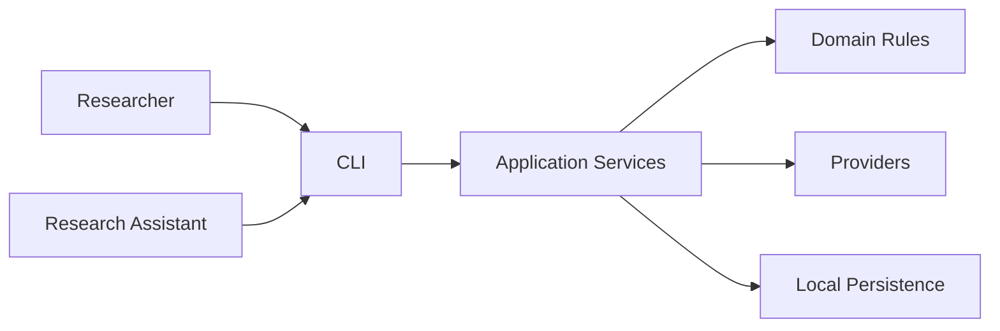
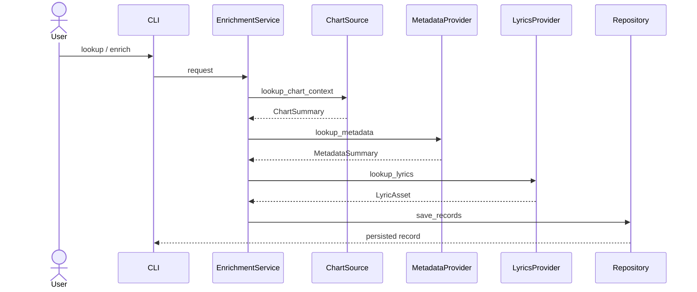
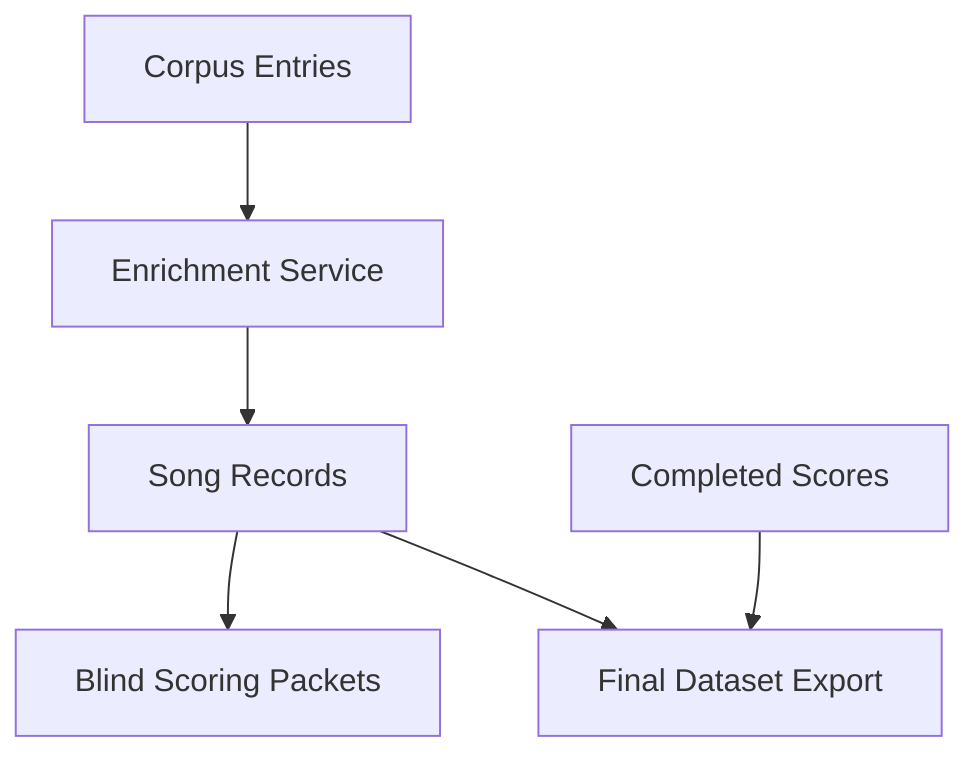

# Diagrams

## System Context

```mermaid
flowchart LR
    Researcher[Researcher]
    Assistant[Research Assistant]
    CLI[CLI]
    App[Application Services]
    Domain[Domain Rules]
    Providers[Providers]
    Store[Local Persistence]

    Researcher --> CLI
    Assistant --> CLI
    CLI --> App
    App --> Domain
    App --> Providers
    App --> Store
```

## Enrichment Sequence

```mermaid
sequenceDiagram
    actor User
    participant CLI
    participant EnrichmentService
    participant ChartSource
    participant MetadataProvider
    participant LyricsProvider
    participant Repository

    User->>CLI: lookup / enrich
    CLI->>EnrichmentService: request
    EnrichmentService->>ChartSource: lookup_chart_context
    ChartSource-->>EnrichmentService: ChartSummary
    EnrichmentService->>MetadataProvider: lookup_metadata
    MetadataProvider-->>EnrichmentService: MetadataSummary
    EnrichmentService->>LyricsProvider: lookup_lyrics
    LyricsProvider-->>EnrichmentService: LyricAsset
    EnrichmentService->>Repository: save_records
    Repository-->>CLI: persisted record
```

## Data Flow

```mermaid
flowchart TB
    Corpus[Corpus Entries] --> Enrich[Enrichment Service]
    Enrich --> Records[Song Records]
    Records --> Packets[Blind Scoring Packets]
    Scores[Completed Scores] --> Final[Final Dataset Export]
    Records --> Final
```
